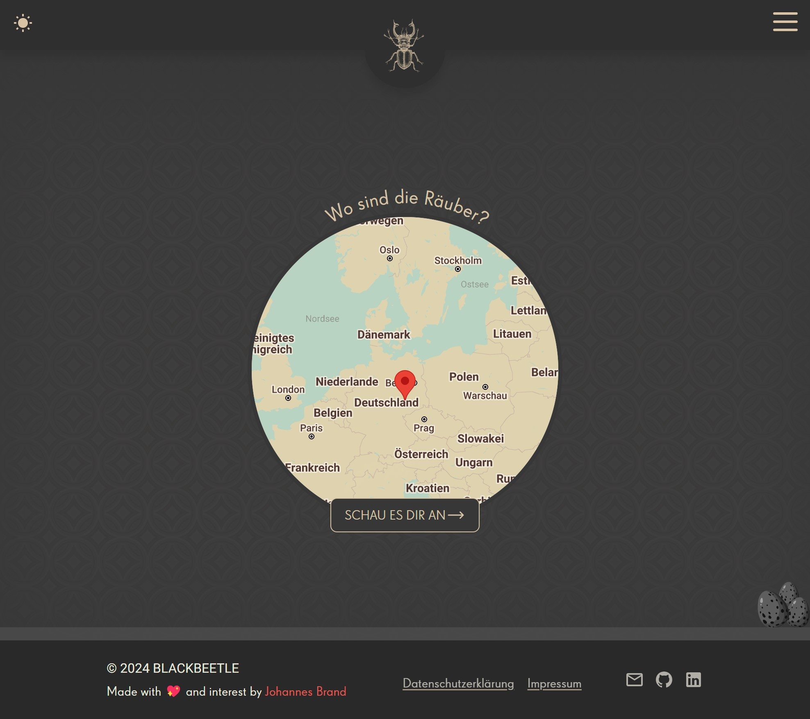

## Blackbeetle Public Frontend

### blackbeetle.de

Blackbeetle is a small private website project that I started before my trip to Australia. In order to keep my family and friends up to date without sending everyone the same messages over and over again, I set up this little travel blog. The project has changed a lot over time. Whenever I try out a new technology, Blackbeetle is my test object. Initially, the entire page was implemented with Laravel framework. I later separated the API and created two frontends, one for the public and one for the administration.

Other parts of this Project are the [Admin Frontend](https://github.com/j-brand/blackbeetle-frontend) and the [Backend API](https://github.com/j-brand/blackbeetle-backend)

### Blackbeetle Public Frontend

This part of the project has probably changed the most. As part of the Laravel application, the frontend was written with the Blade Template Engine, after the split of front and backend in ReactJs and currently VueJs with Nuxt 3.

#### Features:
- Image Galleries with sereprate view, zoom and autoplay functionality
- Blog with four different Posttypes
    - Text
    - Image Slider
    - Video
    - Google Maps map with custom pins and descriptions
- Blog post comments
- Sign in for Blog updates
- Dark and Light mode

#### Technologies and libraries used:
- [VueJS](https://vuejs.org/)
- [Nuxt 3.0](https://nuxt.com/)
- [Tailwind CSS](https://tailwindcss.com/)
- Googe Maps API
- [SwiperJs](https://swiperjs.com/)
- [lightgallery](https://www.lightgalleryjs.com/)
- for more infos check out the package.json

### Featrues to come

- Update Nuxt and other Depenencies