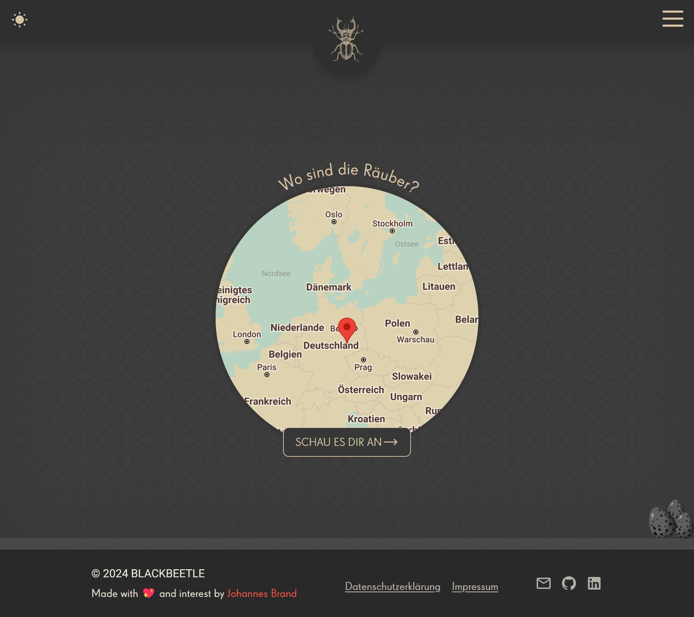

## Blackbeetle Public Frontend


### blackbeetle.de


Blackbeetle is a small private website project that I started before my trip to Australia. In order to keep my family and friends up to date without sending everyone the same messages over and over again, I set up this little travel blog. The project has changed a lot over time. Whenever I try out a new technology, Blackbeetle is my test object. Initially, the entire page was implemented with Laravel framework. I later separated the API and created two frontends, one for the public and one for the administration.

Other parts of this Project are the [Admin Frontend](https://github.com/j-brand/blackbeetle-frontend) and the [Backend API](https://github.com/j-brand/blackbeetle-backend)

### Blackbeetle Public Frontend

This part of the project has probably changed the most. As part of the Laravel application, the frontend was written with the Blade Template Engine, after the split of front and backend in ReactJs and currently VueJs with Nuxt 3.



#### Features:
- Image Galleries with sereprate view, zoom and autoplay functionality
- Blog with four different Posttypes
    - Text
    - Image Slider
    - Video
    - Google Maps map with custom pins and descriptions
- Blog post comments
- Sign in for Blog updates
- Dark and Light mode

#### Technologies and libraries used:
- [VueJS](https://vuejs.org/)
- [Nuxt 3.0](https://nuxt.com/)
- [Tailwind CSS](https://tailwindcss.com/)
- Googe Maps API
- [SwiperJs](https://swiperjs.com/)
- [lightgallery](https://www.lightgalleryjs.com/)
- for more infos check out the package.json

---

## Entwicklung

Die Entwicklungsumgebung laeuft in Docker Compose. Der Container fuehrt nur den
Nuxt-Dev-Server aus; editiert wird auf dem Host, `node_modules` wird zwischen
beiden geteilt (Host und Image benutzen Node 22 auf glibc).

Das Backend (`bb-backend`) muss laufen, bevor das Frontend startet: der
Container haengt sich fuer SSR in dessen Docker-Netz.

```bash
docker compose -f ../bb-backend/docker-compose.yml up -d   # falls noch nicht laeuft
cp .env.example .env    # Werte pruefen, v.a. APP_PORT und die API-URLs
docker compose up -d    # erster Start installiert Dependencies via npm ci
docker compose logs -f app
```

Der Dev-Server haengt danach auf <http://localhost:3021> (nur auf dem Loopback).

| Dienst                   | URL                     |
| ------------------------ | ----------------------- |
| Frontend (dieses Repo)   | <http://localhost:3021> |
| Backend-API (bb-backend) | <http://localhost:3020> |

### Befehle

```bash
docker compose exec app npm run test:run    # Tests
docker compose exec app npm run lint        # ESLint
docker compose exec app npm run typecheck   # vue-tsc
docker compose exec app npm ci              # nach Dependency-Updates
docker compose down                         # stoppen
```

Weil `node_modules` geteilt ist, funktionieren dieselben Befehle auch direkt auf
dem Host (`npm run test:run`), ebenso ESLint und Volar in der IDE.

### Umgebungsvariablen

Alle in `.env` (siehe `.env.example`):

- `NUXT_PUBLIC_API_BASE` — API-URL fuer den Browser
- `NUXT_API_BASE_INTERNAL` — API-URL fuer SSR im Container. `localhost` zeigt
  dort auf den Container selbst, und der Host-Gateway hilft nicht, weil
  bb-backend nur auf `127.0.0.1` published. Deshalb spricht das Frontend den
  Backend-Container ueber das gemeinsame Netz direkt an (`http://bb-backend-app`).
- `NUXT_PUBLIC_BACKEND_URL` — Basis fuer Bilder und Videos
- `NUXT_DEV_HOST` — optional. Gesetzt, wenn der Dev-Server hinter einem
  Reverse-Proxy unter einer Domain erreichbar sein soll; aktiviert
  `allowedHosts` und HMR ueber `wss`. Leer lassen fuer rein lokale Arbeit.

Das lokale Backend muss die Origin des Dev-Servers erlauben — in
`bb-backend/.env` unter `CORS_ALLOWED_ORIGINS` (`http://localhost:3021`).

### Zugriff ueber die Domain (WireGuard)

Erreichbar ist der Dev-Server unter <https://bb-frontend.blacknectar.de> — aber
nur ueber das WireGuard-VPN. Oeffentlich zeigt der Name weiterhin auf den
netcup-Host.

API und Medien laufen bewusst ueber **dieselbe Origin**: Caddy routet
`/api/*` und `/storage/*` an das Backend (Port 3020), alles andere an Nuxt
(Port 3021). Damit gibt es keinen CORS-Fall, keine Mixed-Content-Sperre und nur
ein Zertifikat, dem der Client vertrauen muss. `NUXT_PUBLIC_API_BASE` bleibt
deshalb leer, die App ruft `/api/v1/...` relativ auf.

Ohne Caddy davor (`http://localhost:3021`) uebernimmt der `devProxy` aus
`nuxt.config.ts` dieselben beiden Pfade, sodass beide Zugangswege funktionieren.
SSR geht ohnehin direkt an den Backend-Container (`NUXT_API_BASE_INTERNAL`).

Serverseitig haengt das an drei Stellen (Muster der uebrigen Dienste):

| Datei                        | Eintrag                                           |
| ---------------------------- | ------------------------------------------------- |
| `/etc/dnsmasq.d/dev-wg.conf` | `address=` + `local=` fuer den Namen auf 10.99.0.1 |
| `/etc/hosts`                 | derselbe Name auf 10.99.0.1                        |
| `/etc/caddy/Caddyfile`       | `handle`-Bloecke fuer /api, /storage und den Rest  |

Caddy benutzt `local_certs`, die Zertifikate stammen also aus einer internen CA
und laufen nach 12 Stunden ab (Caddy erneuert sie automatisch). Deshalb taugen
Klick-dich-durch-Ausnahmen im Browser nichts — sie brechen bei jeder
Erneuerung. Stattdessen die Root-CA im Browser hinterlegen:
`/var/lib/caddy/.local/share/caddy/pki/authorities/local/root.crt`.
Firefox hat einen eigenen Zertifikatsspeicher und ignoriert den des Systems,
solange `security.enterprise_roots.enabled` nicht gesetzt ist.

Der Laptop nutzt laut `/etc/dnsmasq.d/dev-wg.conf` sein eigenes `/etc/hosts` —
neue Namen muessen dort also von Hand ergaenzt werden. Der dnsmasq-Eintrag gilt
nur fuer Clients, die 10.99.0.1 als Resolver verwenden.

Backups von System-Dateien gehoeren **nicht** nach `/etc/dnsmasq.d/` — dnsmasq
liest dort jede Datei und startet sonst nicht mehr.

### Bild-URLs und APP_URL

Laravel baut Medien-URLs absolut aus seiner `APP_URL`. Sie steht auf
`https://bb-frontend.blacknectar.de`, damit Bilder ueber dieselbe Origin
ausgeliefert werden. Wer ueber `http://localhost:3021` arbeitet, bekommt die
Bilder deshalb weiterhin von der Domain — ohne VPN bleiben sie leer. Fuer reinen
Localhost-Betrieb `APP_URL` im Backend auf `http://localhost:3021` stellen.

### Rein lokal arbeiten

`NUXT_DEV_HOST` in `.env` leeren; `NUXT_PUBLIC_API_BASE` kann leer bleiben, weil
der `devProxy` die API auch auf localhost bedient. `NUXT_PUBLIC_BACKEND_URL` und
die `APP_URL` des Backends dann auf `http://localhost:3021` setzen.

### Nicht mehr benutzt

`flake.nix`, `flake.lock`, `.envrc`, `devenv.root` und `.devcontainer/` sind
Ueberbleibsel der frueheren Nix- bzw. Devcontainer-Umgebung und werden nicht
mehr verwendet.

---

### Features to come

- Update Nuxt and other Dependencies